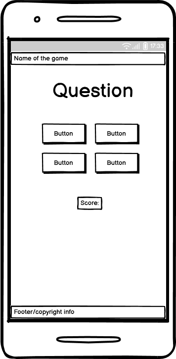
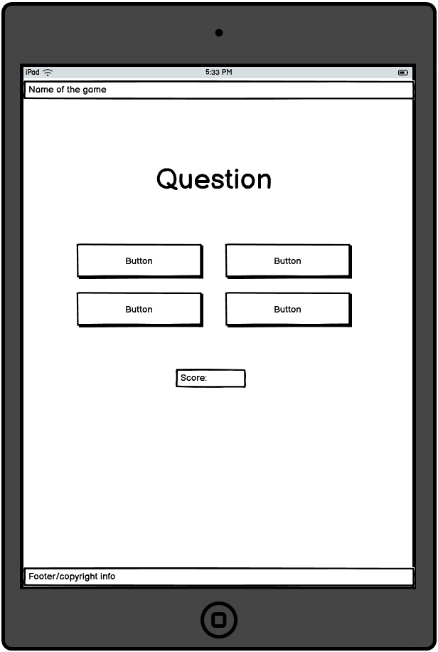

# Quizzie!

## Table of contents

1. Goals
2. Target Audience
3. User goals
4. Features
5. Manual testing
6. Validation and lighthouse reports

## Project goals

The primary goal for Quizzie is a fun quiz for kids to enyoy and challange their friends and family!

### Target audience

Main audience is children and families.

### User goals:

* Enyoy a fun time
* Challenge friends and family

### Wireframes

* Wireframes created in [Balsamiq](https://balsamiq.com/wireframes/desktop/#) for different screensizes 
Tablets and larger screens: 
 
 
Mobile devices: 

 
 

* The wireframe is a starting idea and the final design was improved along with the project for better visuals.

### Features

* Navigation bar at top for SEO purpose

* Footer provides copyright information 

### Manual testing

* I have manually tested all the links and buttons on the website

| Feature  | Excpect  | Action  | Result  |
|:---|:---:|:---:|---:|
|  Buttons | Add score if correct  | Clicked all buttons manually  |  Added score if correct | 
|  End of game | Display new buttons to choose from  | Clicked the link manually  | New buttons appear and works as intended  |

### Deployment

* All code was written in github editor, to deploy the website the following steps was used: 
    1. In the Github repository, go to Settings
    2. From the menu to the left, click "Pages"
    3. Under "Default branch", make sure it says "Main" and save.
    4. Go back to the repository and update, under deployment to the right, it should say "github-pages" with a green checkmar.
    5. If it doesn't show, try to update the site again as it takes a while sometimes.

### Final testing 

* Lighthouse testing: 

* Validator testing:
    - HTLM Validation: Passed without any error. It says the links are empty due to the face there is only a picture of the relevant social media platform.
     
    
    
    
    - CSS Validation: Passed without any errors. 
    
    
    
    - Screensize responsiveness is tested in the browser down to 280px

    - JavaScript code is tested on JShint with no errors found.

### Bugs

* No bugs where discovered.

### Credits 

* A big thank you to my mentor Spencer and Kay for supporting me while building this
* Background image is generated from Microsoft Co-pilot.
* Bootstrap documentation and the [Bootstrap library](https://getbootstrap.com/docs/5.3/getting-started/introduction/), version 5.

### Future features

* Add more questions
* An option to change difficulty of the quiz to make it for adults as well.
* More options for the user to change background
* Add a highscore-system